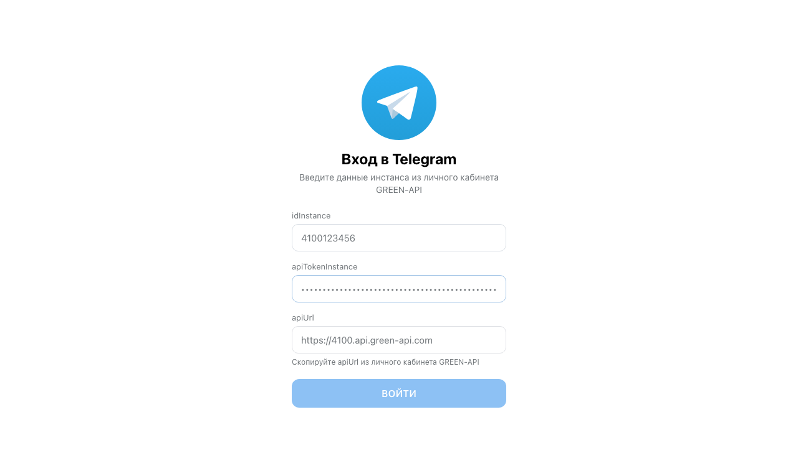
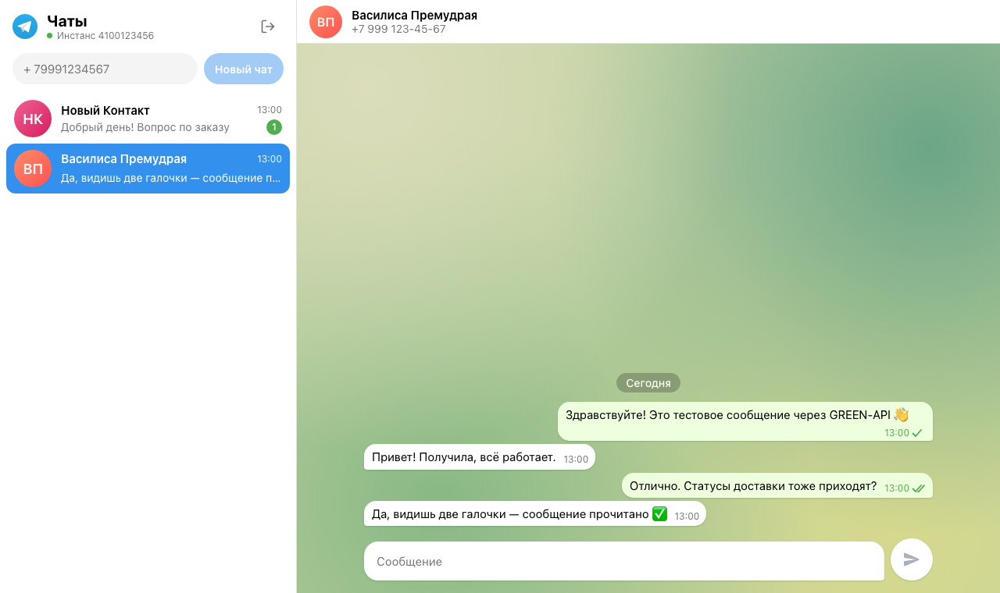
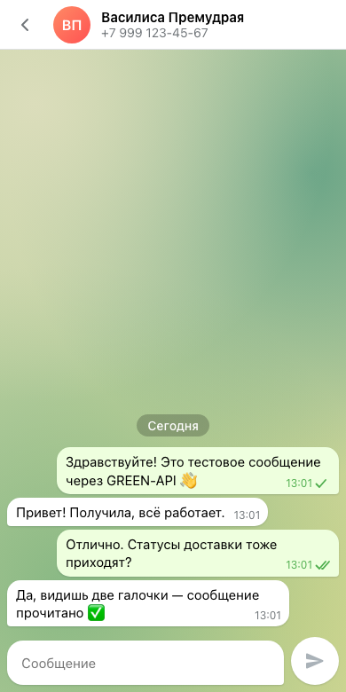
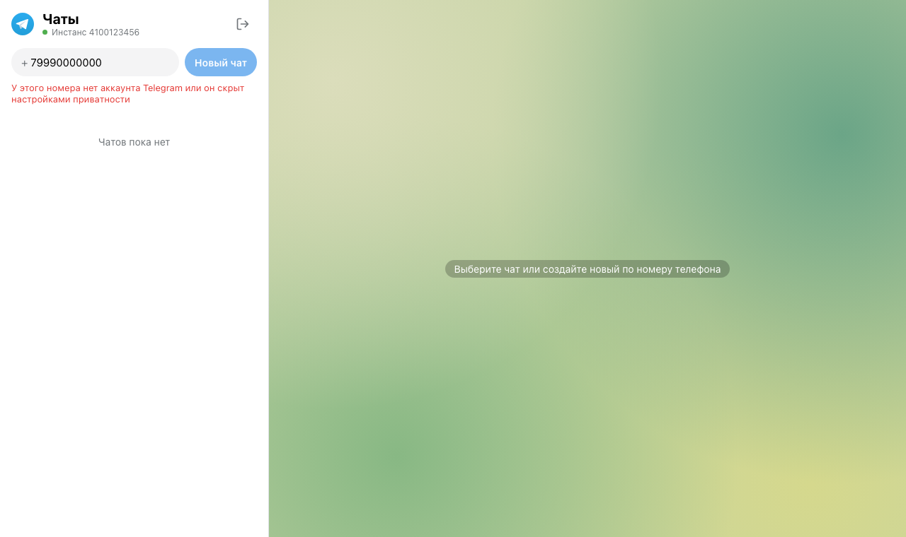

# Telegram Web · GREEN-API

Тестовое задание «Фронтенд-разработчик React»: веб-интерфейс для отправки и получения текстовых сообщений в Telegram через [GREEN-API](https://green-api.com/telegram). Внешний вид повторяет [web.telegram.org](https://web.telegram.org/).

**Демо:** https://000egor000.github.io/green-api-chat-test-task/ — войдите с `idInstance` и `apiTokenInstance` своего Telegram-инстанса GREEN-API (настройки инстанса описаны ниже).

## Скриншоты

| Вход | Чат |
| --- | --- |
|  |  |

| Мобильная версия | Понятные ошибки |
| --- | --- |
|  |  |

Скриншоты сняты на сборке проекта, запросы к GREEN-API в них замоканы, как в e2e-тестах.

## Локальный запуск

```bash
npm install
npm run dev      # http://localhost:5173
npm run build    # статическая сборка в dist/
npm run format   # prettier
```

Нужен Node.js 20+ (`nvm use`).

## Проверки

```bash
npm run typecheck && npm run lint && npm test && npm run test:e2e
```

- **Unit (Vitest):** reducer и слияние статусов, восстановление данных из `localStorage`, HTTP-клиент, разбор уведомлений, хуки long polling и мессенджера, включая гонку «статус пришёл раньше ответа `sendMessage`».
- **E2E (Playwright):** основной сценарий задания — вход, чат по номеру, отправка и ответ собеседника — плюс ошибки, новый контакт с непрочитанными, сохранение истории и прокрутка. GREEN-API в e2e замокан, аккаунт не нужен.

## Подготовка инстанса GREEN-API

1. В [личном кабинете](https://console.green-api.com/) создайте инстанс Telegram и авторизуйте его.
2. В настройках инстанса задайте следующие значения ([SetSettings](https://green-api.com/telegram/docs/api/account/SetSettings/)). После создания инстанса все настройки выключены, а изменения применяются в течение 5 минут.

| Настройка | Значение | Зачем |
| --- | --- | --- |
| `webhookUrl` | пусто | иначе HTTP API не отдаёт уведомления (ошибка 400 «webhook url is set») |
| `incomingWebhook` | `yes` | входящие сообщения |
| `outgoingWebhook`, `outgoingAPIMessageWebhook` | `yes` | статусы доставки и прочтения |
| `outgoingMessageWebhook` | `yes` | сообщения, отправленные с телефона |
| `stateWebhook` | `yes` | уведомление, если инстанс разлогинится |

При входе приложение само проверяет состояние инстанса, его тип, `webhookUrl` и `incomingWebhook`, и объясняет, что исправить.

## Как пользоваться

1. Ввести `idInstance` и `apiTokenInstance`. `apiUrl` подставится по первым 4 цифрам `idInstance` (`https://4100.api.green-api.com`); его можно исправить на значение из личного кабинета.
2. Ввести номер получателя (например `79991234567`) и нажать «Новый чат».
3. Написать сообщение: Enter отправляет, Shift+Enter переносит строку.
4. Ответ получателя появится в чате автоматически.

## Как устроено

| Действие | Метод GREEN-API |
| --- | --- |
| Проверка учётных данных при входе | [`getStateInstance`](https://green-api.com/telegram/docs/api/account/GetStateInstance/) |
| Номер → `chatId` при создании чата | [`checkAccount`](https://green-api.com/telegram/docs/api/service/CheckAccount/) |
| Отправка | [`sendMessage`](https://green-api.com/telegram/docs/api/sending/SendMessage/) |
| Получение | [`receiveNotification`](https://green-api.com/telegram/docs/api/receiving/technology-http-api/ReceiveNotification/) + [`deleteNotification`](https://green-api.com/telegram/docs/api/receiving/technology-http-api/DeleteNotification/) |

- Входящие приходят с внутренним `chatId` Telegram, а не с номером. Поэтому при создании чата номер сначала переводится в `chatId` через `checkAccount`, и ответы попадают в нужный чат.
- Получение работает через long polling: `receiveNotification?receiveTimeout=20`, затем `deleteNotification`, и так в цикле.
  - У запроса есть клиентский таймаут, поэтому «подвисшее» соединение не блокирует цикл.
  - При ошибке сети запрос повторяется с экспоненциальной задержкой (1 → 30 с), статус соединения виден в шапке.
  - На 401/403 опрос останавливается, в шапке появляется сообщение об отказе в доступе.
- Обрабатываются уведомления:
  - `incomingMessageReceived` и `outgoingMessageReceived` (отправлено с телефона). В группах чат называется по имени группы, а не по автору сообщения;
  - `outgoingMessageStatus` (галочки). Статус `failed` может прийти без `idMessage` — тогда ошибкой помечается последнее неподтверждённое сообщение этого чата, а причина (например, «chatId unresolvable on this session») показывается понятным текстом;
  - `stateInstanceChanged` и `quotaExceeded` — предупреждение в шапке.

  Остальные уведомления и нетекстовые сообщения удаляются из очереди и не показываются.
- `checkAccount` часть ошибок возвращает со статусом HTTP 200 (`{status: false, reason}`) — они не выдаются за «номер не зарегистрирован». Номера без аккаунта запоминаются на сессию: документация предупреждает, что частые проверки одного номера ведут к ограничениям.
- Статусы сопоставляются по паре `chatId` + `idMessage`: по документации `idMessage` уникален только внутри одного чата.
- Сообщение появляется в чате сразу, со статусом «отправляется».
  - После ответа `sendMessage` ему присваивается `idMessage` с сервера. React-ключ при этом не меняется, пузырь не перемонтируется.
  - Если статус «прочитано» пришёл раньше ответа `sendMessage`, он запоминается и применяется при подтверждении.
  - Статусы не откатываются назад: поздний `sent` не перетирает `read`.
  - При ошибке ставится пометка «!», причина видна в подсказке.
- Сообщения упорядочены по `timestamp`: опоздавшие уведомления встают на своё место.
- Учётные данные и история чатов (до 500 последних сообщений на чат) хранятся в `localStorage`, история отдельно для каждого инстанса. Сохранение идёт с задержкой 500 мс; при закрытии вкладки и выходе состояние сохраняется сразу. При чтении каждое поле проверяется, повреждённые записи отбрасываются.

## Ограничения

- Сделан вариант для Telegram, как разрешено в задании. У MAX тот же набор методов (документация v3), и переход сводится к текстам, лимиту длины сообщения (4000 вместо 4096) и проверке номера (только +7 и +375).

- GREEN-API не отдаёт историю переписки через HTTP API уведомлений, поэтому история живёт только в `localStorage` этого браузера.
- При выходе история инстанса не удаляется, чтобы при повторном входе переписка осталась. На общем компьютере стоит учитывать, что токен и переписка лежат в `localStorage` открытым текстом.
- Приложение рассчитано на одну вкладку: две вкладки делят одну очередь уведомлений GREEN-API, и каждая получит только часть сообщений.
- Повторной отправки для неотправленного сообщения нет, его нужно написать заново.

## Структура

**Публичный API.** У каждого слоя (`api`, `components`, `constants`, `hooks`, `store`, `utils`) есть `index.ts`.
- Из другого слоя импортируем только корень: `import { sendMessage } from '../api'`. Это проверяет ESLint.
- Внутри слоя модули ссылаются друг на друга напрямую.
- В `index.ts` экспортируется только то, что нужно снаружи.

**Один модуль — одна сущность:** компонент, хук, функция, класс или словарь-константа. Исключения:
- модули только с типами (`types.ts`, `api/types.ts`, `store/chats/storedTypes.ts`);
- приватный `Props` компонента;
- приватные константы-настройки модуля.

```
src/
  App.tsx, main.tsx, index.css   точка входа, дизайн-токены (все цвета — CSS-переменные)
  types.ts                        доменные типы: Chat, Message, Credentials, ConnectionState
  api/
    request.ts, buildUrl.ts       HTTP-вызов GREEN-API: понятные ошибки вместо TypeError/SyntaxError
    GreenApiError.ts, describeStatus.ts, guessApiUrl.ts
    types.ts                      типы запросов, ответов и уведомлений
    methods/                      по файлу на метод: getStateInstance, checkAccount, sendMessage,
                                  receiveNotification, deleteNotification
    notifications/                type guards, whitelist статусов, разбор вебхука в сообщение
  store/
    chats/                        chatsReducer и его части: actions, createChat, fillChat, findChatIndex,
                                  insertMessage, mergeStatus; чтение и запись: loadChats, saveChats,
                                  restoreChat, restoreMessage, isMessageStatus, optionalString, storedTypes
    credentials/                  loadCredentials, saveCredentials, clearCredentials, credentialsStorageKey
  hooks/
    useMessenger.ts               логика мессенджера: уведомления, создание чата, отправка, стабильные колбэки
    useNotifications.ts           long polling: backoff, таймаут, остановка на 401/403
    useChats.ts                   reducer + отложенное сохранение
    useCredentials.ts, useAsyncAction.ts, useLatest.ts
  components/                     один компонент = .tsx + .module.css
  styles/text.module.css          общие CSS-классы (подключаются через composes)
  constants/
    texts/                        все тексты интерфейса и ошибок, по словарю на модуль
    icons.ts, avatarGradients.ts, greenApi.ts, phone.ts, locale.ts
  utils/
    date/, chat/, avatar/, storage/   по функции на файл
    UserError.ts, userMessage.ts, BoundedMap.ts, createLocalId.ts, replaceAt.ts,
    invokeSafely.ts, cx.ts, onlyDigits.ts, formatPhone.ts, sleep.ts
e2e/                              Playwright-сценарии и support/ с моком GREEN-API
```

Стек: React 18, TypeScript, Vite, CSS Modules. В рантайме никаких зависимостей, кроме React. Для разработки: Vitest, Testing Library, Playwright, ESLint, Prettier.
